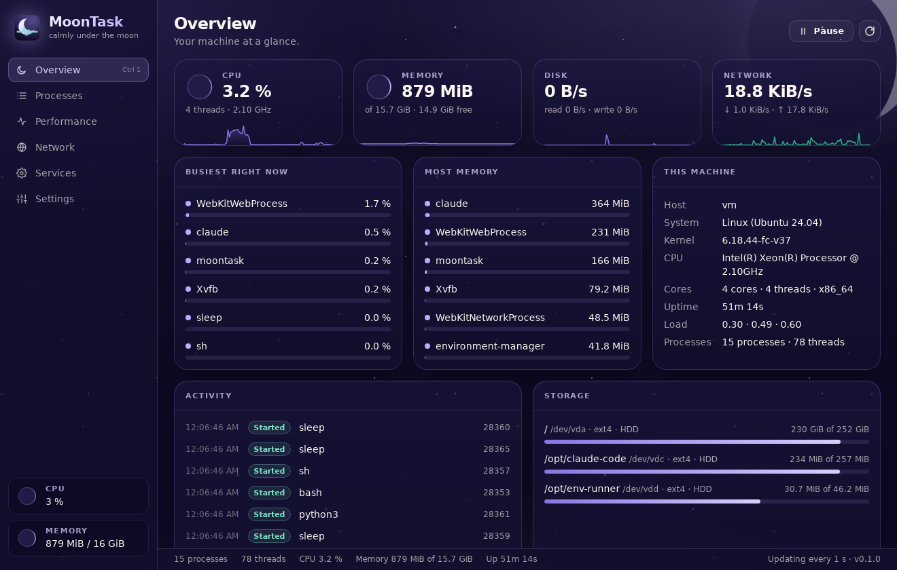
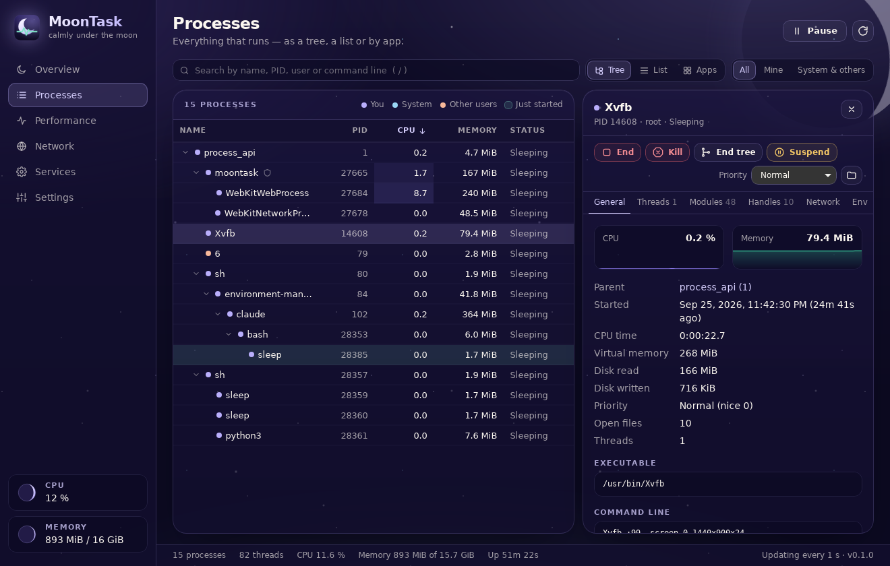

# MoonTask

> Every process, calmly under the moon.

MoonTask is a modern, open-source task manager for Windows, macOS and Linux — in the spirit of
[TaskExplorer](https://github.com/DavidXanatos/TaskExplorer) and Process Explorer, but calmer,
better organized and in the same night-sky design as [MoonDisk](https://github.com/Luna-OS/MoonDisk).





## Features

- **Overview** — CPU, memory, disk and network at a glance (as moon phases), the busiest and
  largest processes, facts about the machine, storage, and a live feed of processes that
  start and end
- **Processes** in three views:
  - **Tree** — parent and child processes; searching keeps the path to every match visible
  - **List** — every process, flat and sortable
  - **Apps** — processes of the same program grouped and summed (30 browser processes become
    one row), with *End all*
- Search by name, PID, user, executable or command line; filter by owner (mine / system &
  others); newly started processes briefly light up
- **Detail panel** for the selected process: general facts with CPU/memory sparklines, threads,
  loaded modules, open handles, its network connections and environment variables
- **Actions**: end, force kill, end the whole process tree, suspend, resume, change priority,
  show the executable in the file manager
- **Performance** — CPU (total and per core), memory and swap, disk and network throughput over
  time with hover read-outs, volumes, and temperature sensors
- **Network** — every open TCP/UDP connection and listening port, with the process holding it
- **Services** — systemd services (Linux), Windows services and launchd jobs (macOS): state,
  startup type, main process; start, stop and restart
- Night and day themes (or follow the system), adjustable refresh rate, pause, and full
  keyboard control

### Better organized than a classic task manager

- One sidebar with six clear sections instead of a wall of tabs; the process details open next
  to the list instead of in a separate window
- Kernel threads are hidden by default (they can be shown in Settings), so the list stays
  readable on Linux
- CPU is shown as a share of the *whole* machine, so the column adds up to the total
- MoonTask keeps its own footprint small: it measures once per interval and only animates what
  carries information

## Safety

Ending the wrong process can lose unsaved work or take the system down. MoonTask is careful by
design, and the rules live in the Rust core (`src-tauri/src/control/guard.rs`), not only in the
UI:

- **Protected processes** — the kernel, init/launchd, the Windows session processes (csrss,
  wininit, lsass, …) and MoonTask itself can't be ended, suspended or re-prioritized
- **Confirmation** — ending someone else's or a system process, ending a whole tree, and every
  service change always need an explicit confirmation; for your own processes it's a setting
- **No PID mix-ups** — every action names the process by PID *and* start time and is re-checked
  right before it runs, so a PID the OS has meanwhile given to another process is never touched
- **Never realtime** — MoonTask won't set realtime priority, which can freeze a machine
- No telemetry and no network access of its own; the webview can't reach the network at all

## Keyboard

| Keys                   | Action                              |
|------------------------|-------------------------------------|
| `Ctrl 1` … `Ctrl 6`    | Switch section                      |
| `/` or `Ctrl F`        | Search processes                    |
| `↑ ↓ Page↑ Page↓ Home End` | Move through the process list   |
| `← →`                  | Collapse / expand a branch          |
| `Delete`               | End the selected process            |
| `Shift Delete`         | Force kill the selected process     |
| `Space`                | Pause / resume live updates         |
| `F5`                   | Refresh now                         |
| `Escape`               | Clear the search, then the selection |

## Installation

Installers for Windows (`.exe`), macOS (`.dmg`, Apple Silicon and Intel) and Linux
(`.deb`/`.rpm`) are published on the [Releases](https://github.com/Luna-OS/Moon-Task/releases)
page.

MoonTask runs as a normal user. It then sees every process, but can only act on your own and
can't look inside other users' processes (their modules, handles and environment). To manage
everything, start it with administrator rights (Windows: *Run as administrator*; Linux:
e.g. `sudo -E moontask`).

On macOS the app isn't notarized by Apple yet: open **System Settings → Privacy & Security**
and click **Open Anyway** the first time. macOS only lets debuggers look at another process'
threads, modules and handles, so those tabs stay empty there.

## Platform notes

| Feature                       | Linux | Windows | macOS |
|-------------------------------|:-----:|:-------:|:-----:|
| Process tree, CPU, memory, disk I/O | ✓ | ✓ | ✓ |
| End, kill, end tree           | ✓     | ✓ (end = kill) | ✓ |
| Suspend / resume              | ✓     | ✓       | ✓     |
| Priority                      | ✓ (nice) | ✓ (priority class) | ✓ (nice) |
| Threads / modules             | ✓     | ✓       | –     |
| Open handles                  | ✓     | planned | –     |
| Network connections           | ✓     | ✓       | ✓     |
| Services                      | systemd | Service Control Manager | launchd (user) |
| Temperatures                  | ✓     | where exposed | ✓ |

## Development

MoonTask is a [Tauri 2](https://tauri.app) app: a Rust core (`src-tauri/`) and a React +
TypeScript + Tailwind frontend (`src/`), laid out like MoonDisk.

```
src-tauri/src/
  monitor/    the live view of the machine (sysinfo), rates, owner/protection rules
  control/    process actions and their risk guard
  platform/   everything OS-specific: signals, priorities, threads, modules, handles
  services/   systemd / Windows SCM / launchd
  network/    open sockets
  commands/   the thin Tauri IPC layer
src/
  lib/        pure logic: process tree/list/apps, risk, history, formatting (unit-tested)
  components/ process table, detail panel, charts, dialogs
  views/      Overview, Processes, Performance, Network, Services, Settings
```

```sh
npm install
npm run tauri dev        # run the app
npm test                 # frontend tests
npm run lint && npm run typecheck
cargo test --manifest-path src-tauri/Cargo.toml
```

On Linux, Tauri needs `libwebkit2gtk-4.1-dev`, `libgtk-3-dev`, `libayatana-appindicator3-dev`
and `librsvg2-dev`. The Rust core can be built and tested without them:
`cargo test --manifest-path src-tauri/Cargo.toml --no-default-features`.

## License

This repository is licensed under the [MIT License](LICENSE).
